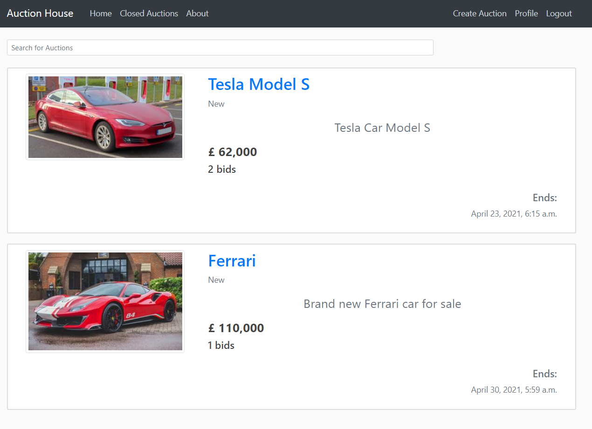

# Auction site (Written in Python/Django)

A web app, where you can auction for items to sell.

- ### Technologies
	- [ ] HTML
	- [ ] CSS
	- [ ] JavaScript
	- [ ] Ajax
	- [ ] Python/django
	- [ ] Sqlite3

## Landing Page

Requirements:
1. Users can create an account on the site and and able to login into their account. 
2. The user’s profile should contain at least an email and their date of birth. 
3. Users should be able to post a new item for auction. Items should contain a title, a 
description, a picture and the date/time the auction Linishes. 
4. Users of the site should then be able to bid for an item, before the end date/time of 
that item. 
5. At the end of the auction, the highest bidder is able to “buy” the item. You do not need 
to implement the “payment” process, but your app should alert the winner, e.g. via a 
message page or as part of their proLile. 
6. The site must contain a page listing all the items that are currently available, with the 
ability for “search” for items based on a given keyword. For instance, searching for 
“table” should return the list of items that have “table” as part of the title or the 
description. The searching mechanism should be done using ajax (so no page 
refreshes). 
7. You should also have a page containing “closed” auctions, detailing the list of biddings, 
and the winner. 
8. The frontend should use Bootstrap, and be responsive. 
9. At the end of the auction, the winner receives an email conLirming that they should 
proceed to purchase the item. You might need to use a cron job, so you regularly 
check for “closed” auctions. 
10. Users are able to send questions to the item owner about the condition of the item, 
and the owner is able to reply to those questions. 
11. Users are able to reset their password, in case they have forgotten it. This would be 
done via a “reset password link” sent to their email. 

## Extra

<a href=''>More details here</a>
